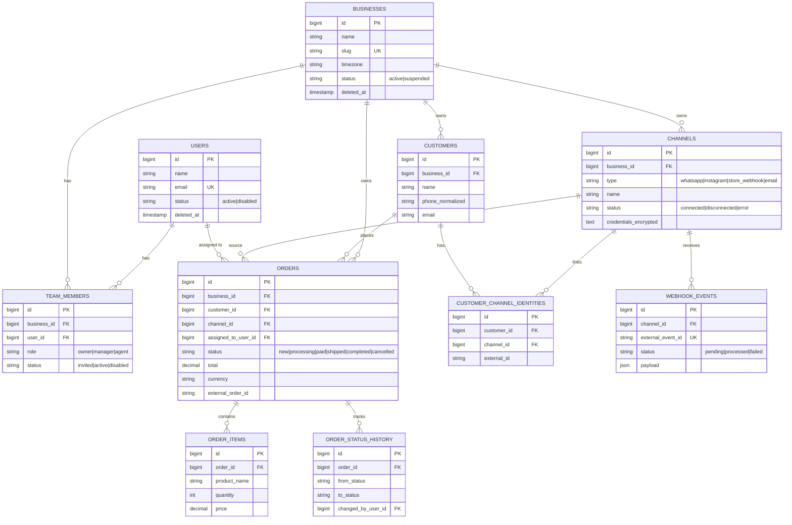

# ERD — منصة الطلبات متعددة القنوات

## القرار المعماري الأهم: كيف يتم عزل بيانات كل تاجر

كل جدول تجاري (Channel, Customer, Order, OrderItem, OrderStatusHistory,
WebhookEvent) يحمل `business_id`، ويُمنع الوصول إليه بثلاث طبقات مستقلة —
عمدًا مكرّرة، لأن نظام SaaS متعدد المستأجرين لا يحتمل نقطة فشل واحدة هنا:

1. **Global Scope تلقائي** (`BelongsToBusinessScope`) على أي Eloquent query
   عادية — يمنع التسريب في أي كود مستقبلي ينسى إضافة `where business_id`.
2. **Middleware يتحقق من العضوية** (`IdentifyBusiness`) قبل الدخول لأي
   route تحت `/b/{business}/...` — يرجع 404 (لا 403) لأي شخص مو عضو، حتى لا
   يكشف حتى وجود الـbusiness.
3. **جلب صريح عبر العلاقة** (`$business->orders()->findOrFail($id)`) لأي
   مورد فرعي (Order, Customer) بدل الاعتماد على Route Model Binding
   المباشر — لأن توقيت تنفيذ الـMiddleware في Laravel لا يضمن أن الـScope
   مفعّل وقت حل الـRoute Model Binding. راجع `docs/ARCHITECTURE.md` لتفصيل
   هذه النقطة تحديدًا، لأنها أهم قرار أمني في المشروع.

## ملاحظات تصميم إضافية

- **`role` على `team_members` نص بسيط (owner/manager/agent) لا جدول
  Roles منفصل**: عمدًا. الأدوار داخل نشاط تجاري بسيطة وثابتة (3 قيم فقط)،
  وربطها بجدول `roles` العام (الخاص بموظفي المنصة نفسها) كان سيخلط بين
  مفهومين مختلفين تمامًا — راجع الفقرة التالية.
- **جدول `roles`/`permissions` العام منفصل تمامًا عن `team_members`**:
  `roles` يمثّل *موظفي المنصة نفسها* (`super_admin`, `support`) الذين
  يديرون كل الأنشطة التجارية، بينما `team_members.role` يمثّل *صلاحية
  المستخدم داخل نشاط تجاري واحد بالتحديد*. عميل عادي للمنصة لا يملك أي صف
  في `roles` إطلاقًا.
- **`order_status_history` بلا `updated_at`**: سجل تاريخي لا يُعدَّل أبدًا
  بعد إنشائه، فلا حاجة لعمود تحديث.
- **`customer_channel_identities` منفصل عن `customers`**: عميل واحد قد
  يتواصل عبر أكثر من قناة (واتساب + انستقرام) بمعرّفات خارجية مختلفة —
  الجدول هذا يربطهم لنفس سجل العميل الداخلي.
